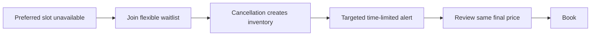
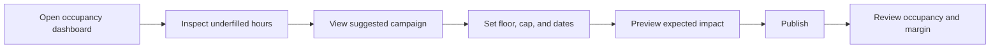

# Prototype Plan

## User Flow Diagram

### Player happy path

```mermaid
flowchart LR
    A["Open app as guest"] --> B["Choose sport and area"]
    B --> C["See live availability"]
    C --> D["Add preferred time and flexibility"]
    D --> E["Compare best match and best value"]
    E --> F["Open recommendation reason"]
    F --> G["Select court-hour"]
    G --> H["Sign in and pay"]
    H --> I["Booking confirmed"]
    I --> J["Invite group via share link"]
```

### Waitlist path

### Owner happy path

## Frontend Prototype Focus

### Level of Fidelity

High-fidelity clickable mobile player flow and mid-fidelity responsive owner dashboard.

### Required player screens

- Guest landing with sport and nearby area
- Search results with map/list toggle
- Recommendation modules:
  - Best match
  - Best value
  - Play earlier/later and save
- Court detail with amenities, policy, rating, and final price
- "Why recommended" explanation
- Lightweight preference onboarding
- Checkout and local payment selection
- Confirmation and group invitation
- Full-slot waitlist and alert state
- Preference/privacy center

### Required owner screens

- Weekly occupancy heatmap
- Court inventory calendar
- Underfilled-period detail
- Campaign recommendation
- Guardrail editor: floor, maximum discount, eligible hours, inventory, budget
- Campaign comparison dashboard

### Key interactions

- Update ranked results as time flexibility changes
- Expand an offer explanation without leaving results
- Preserve a selected slot through login
- Show a visible temporary reservation timer at checkout
- Preview owner campaign impact before publishing
- Pause campaign from the dashboard

### Faked backend

- Hardcoded pilot venues and court inventory
- Three recommendation scenarios:
  - Same venue, adjacent time, lower price
  - Nearby venue, same time, better value
  - Full preferred time with waitlist
- Predetermined owner forecast and campaign results
- Simulated payment and notification

### Prototype copy examples

- "Best match: 8 minutes away at your usual Tuesday time."
- "Save 40,000 VND by starting at 17:00 instead of 18:00."
- "Recommended because you selected a flexible start time and a 5 km radius."
- "This promotion applies to everyone booking this court-hour."

### Usability tasks

1. Find a badminton court for four people near work tomorrow evening.
2. Decide whether to accept a cheaper adjacent time.
3. Explain why the recommended option appeared.
4. Book and invite three friends.
5. Join a waitlist when the preferred time is full.
6. As an owner, create a bounded weekday afternoon campaign.

### Prototype metrics

- Task completion
- Time to selected slot
- Number of result comparisons
- Alternative-time acceptance
- Explanation comprehension
- Trust rating
- Owner campaign configuration errors
