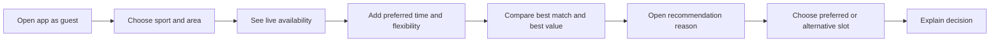

# Prototype Plan

## User Flow Diagram

### Core assumption under test

Will a player accept a different court-hour when the system clearly explains the trade-off between convenience and saving?

### Player test path

## Frontend Prototype Focus

### Level of Fidelity

Mid-fidelity clickable mobile player flow. Visual polish is intentionally limited so feedback stays focused on relevance, comprehension, and trust.

### Required player screens

- Guest landing with sport and nearby area
- Search results with map/list toggle
- Recommendation modules:
  - Best match
  - Best value
  - Play earlier/later and save
- Court detail with amenities, policy, rating, and final price
- "Why recommended" explanation
- Lightweight preference onboarding

### Key interactions

- Update ranked results as time flexibility changes
- Expand an offer explanation without leaving results
- Compare the preferred option against one schedule alternative and one venue alternative
- Select an option and state the reason for the decision

### Faked backend

- Hardcoded pilot venues and court inventory
- Two recommendation scenarios:
  - Same venue, adjacent time, lower price
  - Nearby venue, same time, better value

### Prototype copy examples

- "Best match: 8 minutes away at your usual Tuesday time."
- "Save 40,000 VND by starting at 17:00 instead of 18:00."
- "Recommended because you selected a flexible start time and a 5 km radius."
- "This promotion applies to everyone booking this court-hour."

### Usability tasks

1. Find a badminton court for four people near work tomorrow evening.
2. Decide whether to accept a cheaper adjacent time.
3. Explain why the recommended option appeared.
4. Compare a familiar venue with a relevant new venue.
5. Explain the final choice and any trust concern.

### Prototype metrics

- Task completion
- Time to selected slot
- Number of result comparisons
- Alternative-time acceptance
- Explanation comprehension
- Trust rating

### Explicitly excluded

- Authentication
- Payment
- Group invitations
- Waitlists
- Owner dashboard
- Campaign configuration
- Notification settings

Those flows should be prototyped only after the core recommendation-value assumption is supported.
